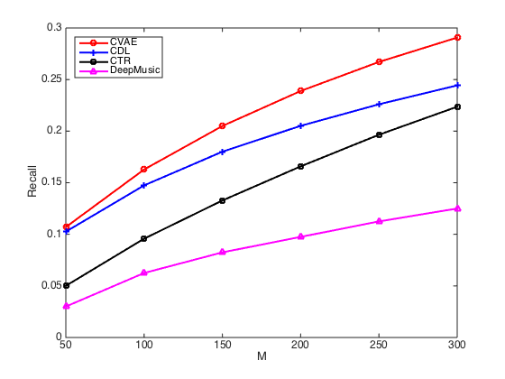

# Collaborative Variational Autoencoder
This code is associated with the following paper:

Xiaopeng Li and James She. Collaborative Variational Autoencoder for Recommder Systems. ACM SIGKDD International Conference on Knowledge Discovery and Data Mining, 2017 (KDD'17).

### Prerequisities
* The code is written in Python 2.7. 
* To run this code you need to have TensorFlow installed. The code is tested with TensorFlow 0.12.1.

### Usage
The program consists of two parts: pre-train in VAE manner and finetuning in CVAE manner. The core code files are in lib/ directory and the test code files are test_vae.py and test_cvae.py. To run the program, you should first run test_vae.py to pre-train the weights of inference network and generation network. The pre-trained weights will be saved under model/ directory. Then test_cvae.py can be run for the CVAE model. And the model will be saved also under model/ directory.

### Note

#### Reproduce
For those who want to exactly reproduce the results in the paper, please note that the author used this evaluation code: lib/evaluatePaper.m to compute the recall for all methods, including baseline methods. However, the author also found out that it may not be exactly correct. Therefore, the author put a correct (as the author thought) evaluation code in lib/evaluationCorrect.m . The author found that the relative performance among all methods remain the same, however the absolute recall rates shift down a little. The following is the figure with the correct evaluation code:

If you want to compare with the model directly using the absolute recall rate, this number should be fair to compare with. However, the author recommends that you should put all baseline methods under the same setting with the same evaluation code for fair comparison.

#### citeulike-t experiment
The citeulike-t dataset is added in `data/citeulike-t`, and the code for experiment is added in `citeulike-t/`.